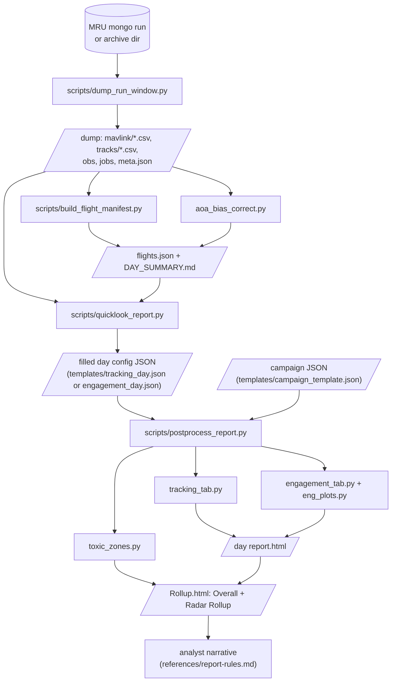
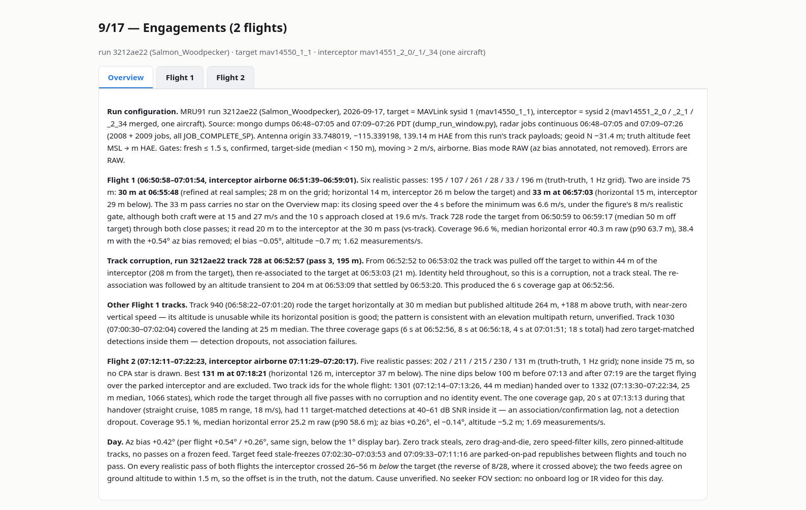
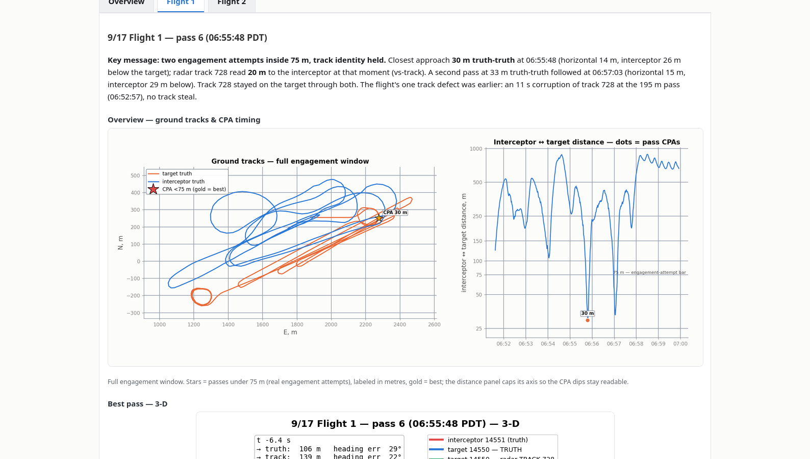
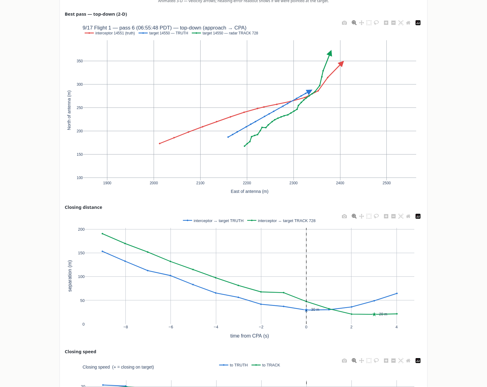
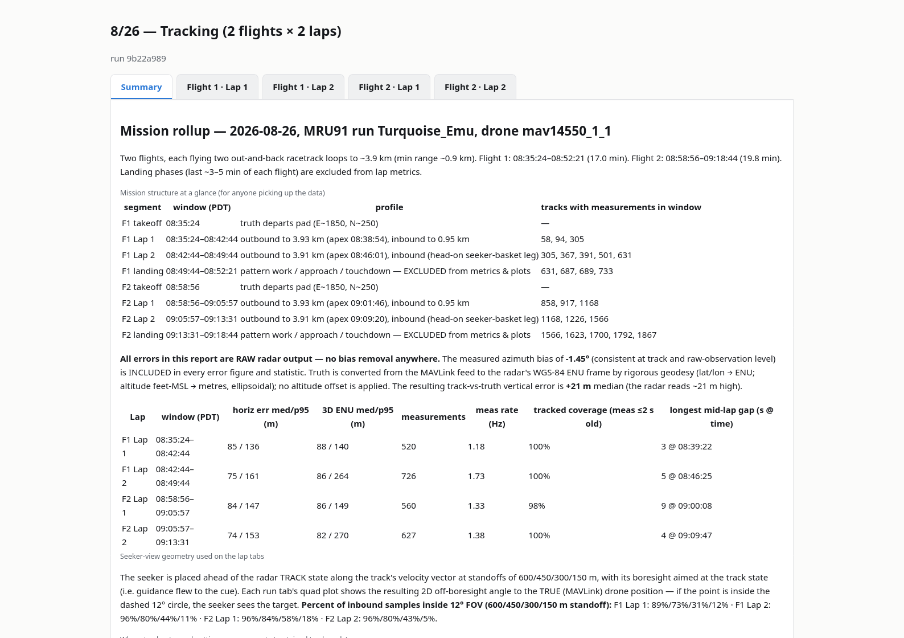
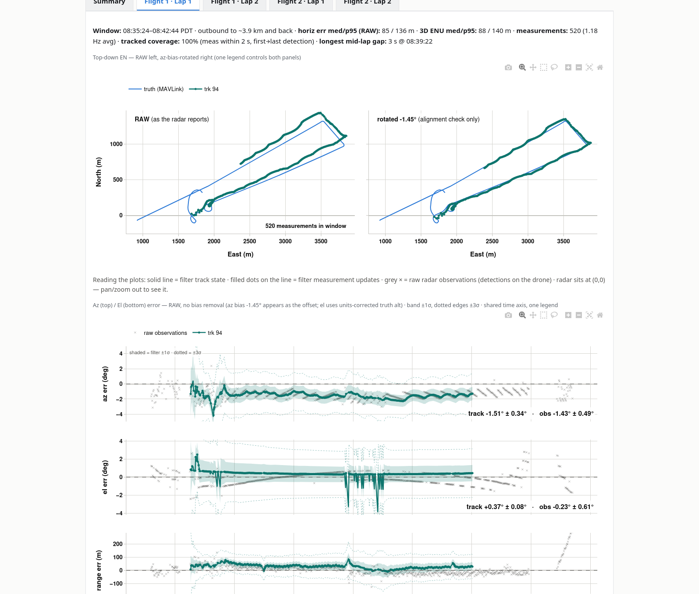
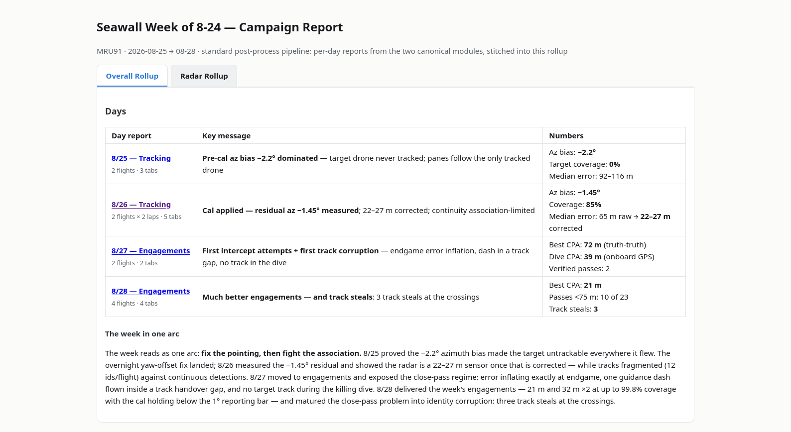
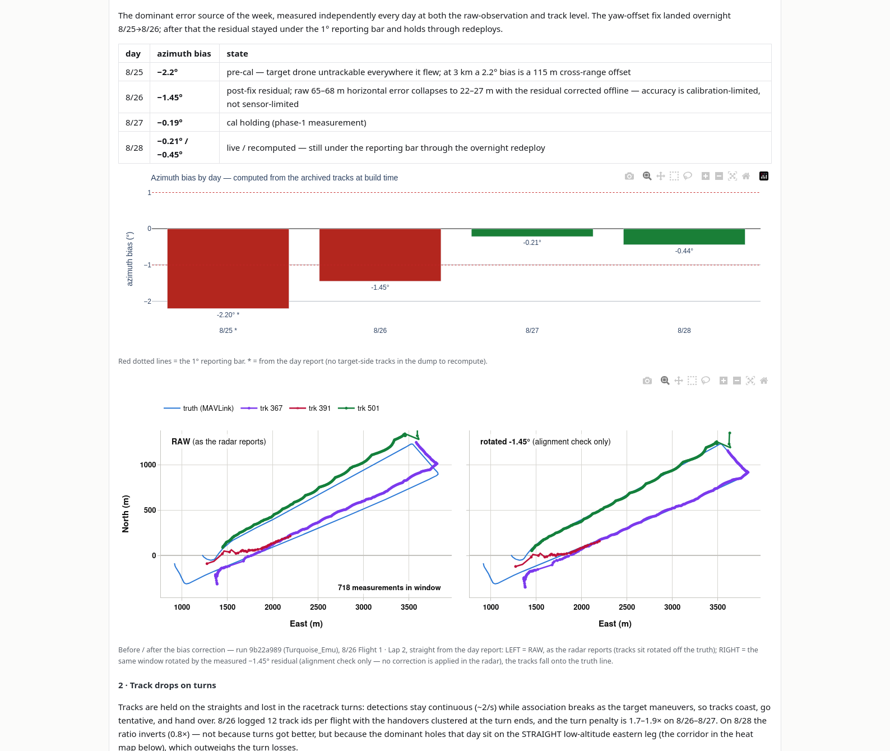

# seawall-post-analysis — visual guide

This folder is a Claude Code skill: `SKILL.md` carries the analyst's rules, `scripts/`
does the deterministic work, `templates/` holds the report configs and `references/`
the detail. This page shows what the skill produces and how the pieces connect.
The screenshots below are real outputs from the Seawall test weeks, unedited.

## What it produces

Given an MRU number, a run and a time window or job range, the pipeline dumps the
radar tracks and the MAVLink drone truth, works out what flew (flights, laps, passes,
track steals), and builds an HTML report for the day. A **tracking day** report has a
Summary tab plus one tab per flight and lap (top-down RAW vs bias-rotated, az/el/range
errors, 3-D position and velocity error, measurement rate, seeker basket, timeline).
An **engagement day** report has one tab per flight at its best pass (ground tracks with
pass CPAs, animated 3-D, closing distance and speed, heading error, track metrics at
CPA). Several days roll up into a campaign report with an Overall Rollup and a Radar
Rollup (azimuth bias by day, drops on turns, corruption and steals at close passes,
week-wide heat map).

The default path is one command, `quicklook_report.py`, which runs the whole chain and
fills the tracking or engagement template automatically. The longer phase-by-phase
workflow in `SKILL.md` is for campaigns and for days where the automatic choices need
judgment.

## Pipeline

Dump once per flight window; the manifest is the single machine-readable statement of
the day; the quick look fills a template from it; the builder turns templates into
pages; the rollup stitches the days and adds the radar-level views; the narrative is
written last, from numbers the scripts printed.

## What the reader gets

### Quick look, engagement day

*Overview tab of a two-flight engagement day built by `quicklook_report.py`: run
configuration, per-flight pass list, corruption events and the day line, all filled
from `flights.json`.*

*Flight tab at its best pass: key message, ground tracks over the full engagement window
with sub-75 m passes starred, and the interceptor-to-target distance timeline.*

*Same tab, the pass itself: 2-D approach to CPA (truth and radar track), closing distance
and closing speed in the CPA window, heading error against line of sight.*

### Tracking day

*Summary tab of a tracking day: mission structure (takeoff, laps, landing), lap metrics
(horizontal and 3-D error, measurement rate, coverage, longest gap) and the units and
bias policy stated once.*

*A lap tab: top-down RAW left and az-bias-rotated right (alignment check only), then az,
el, range and altitude error against time with the raw observations behind the track.*

### Campaign rollup

*Overall Rollup: one row per day with its key message and labelled numbers, then the
campaign paragraph.*

*Radar Rollup: azimuth bias by day against the 1° reporting bar, and the before/after
correction example on the flight the bias was measured on.*

## Where to go next

- `SKILL.md` — the workflow, the judgment calls and the self-test.
- `references/quicklook.md` — the one-command path and what it auto-fills.
- `references/manifest-schema.md` — every field of `flights.json`.
- `references/report-rules.md` — the presentation rules the pages above follow.
- `../../aoa_bias_correct/` — the standalone bias tool the skill's `scripts/aoa_bias_correct.py` mirrors.
